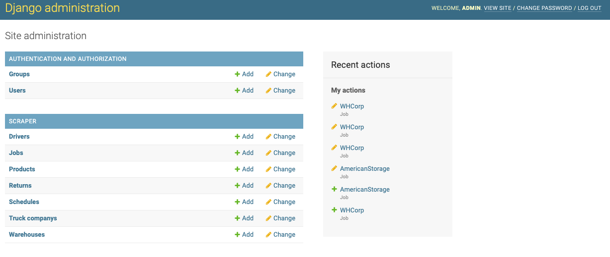
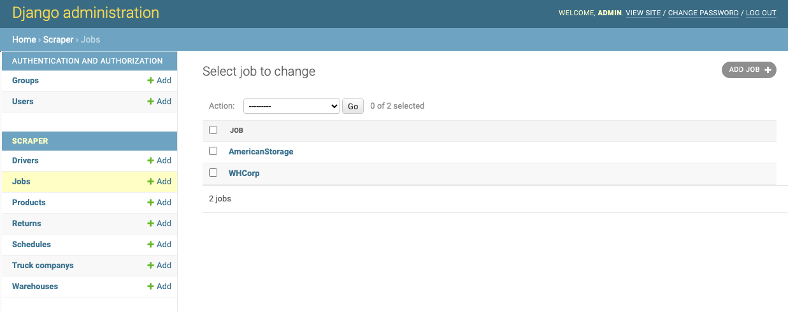
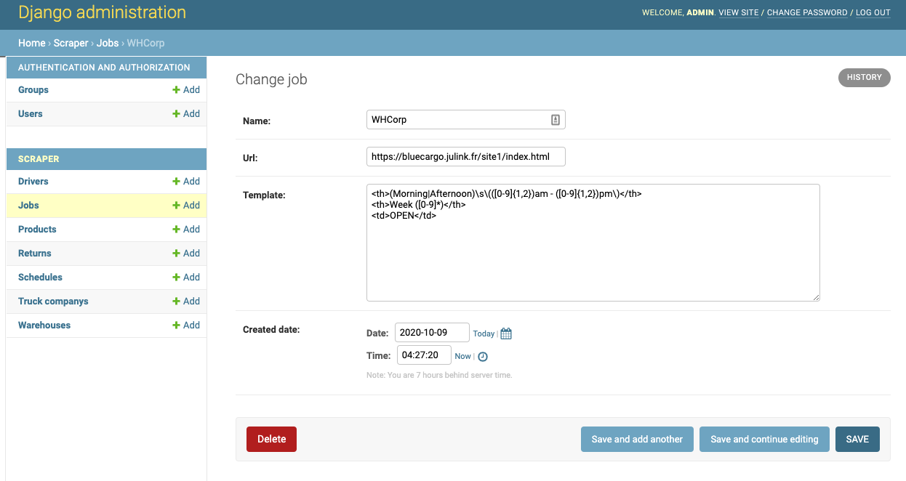
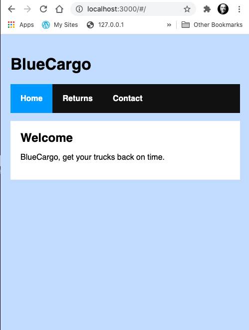
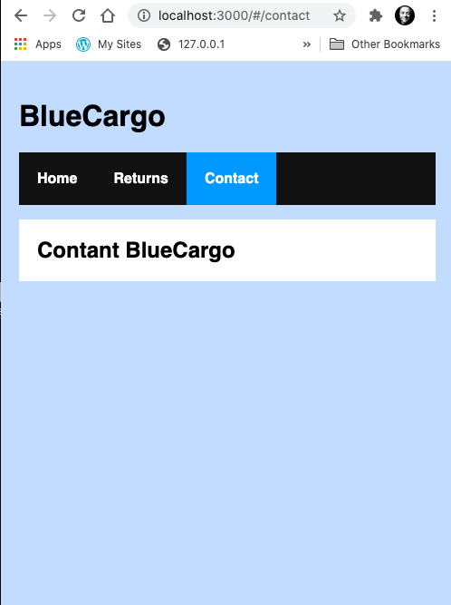
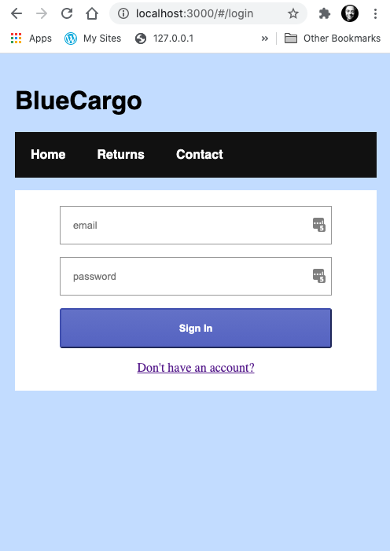
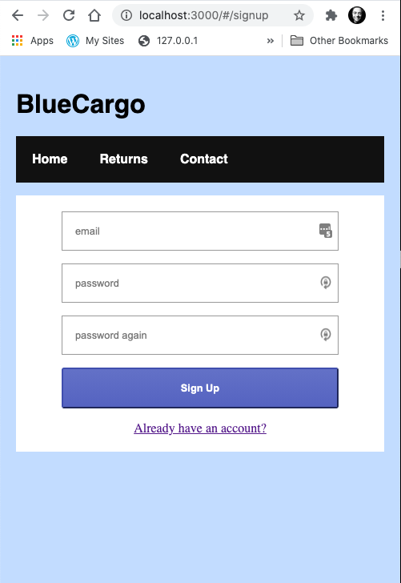
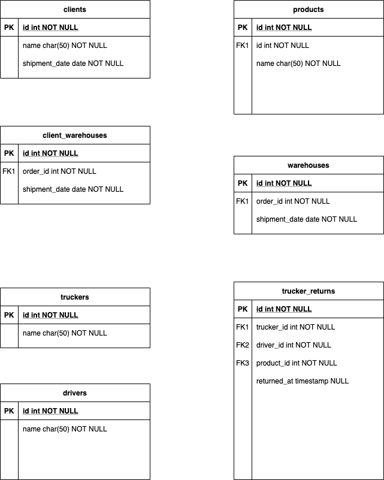

# BlueCargo Challenges

There was a lot here on this challenge.

I created a django project, app, models, one test, and command to scrape the pages.

---
## Django Backend
---

Requires python3 and you will have to create an admin user.

There is a docker container that will spin up in VS code or you can use venv to manage a virtual environment.

```python
$ cd /blue/backend
$ pip install 
$ python manage.py makemigrations
$ python manage.py migrate
$ python manage.py test
$ python manage.py createsuperuser --email admin@example.com --username admin
$ python manage.py runserver
```
Goto url http://localhost:8000/admin

Once you login you can see the admin screen below which lists the main objects.




### The Jobs object
You can createa a job for each of the Warehouses that you want to scrape.


Inside the job you can define a template for the regex that will manage that job


---

```
$ /blue/backend python manage.py scrape
```
I got stuck on the regular expressions, and I decided to move on to other things instead of spinning my wheels there.

---
## React Frontend
---

The container was running NodeJS 12.

To start the frontend

```javascript

$ cd /blue/frontend
$ npm i
$ npm start

```
Link to http://localhost:3000/

Its a Single Page react app with the with authorization forms built in.  

There is a welcome page.



There is a contact page that is public.



But if you click on return you cant get there until you login or create an account. 






The login is not setup to authorize against anything but could quickly be setup to authorize against Django.

---

## Challenge #2 

*What language would this application be written in? Why is this your choice? (Note: any language is fine, we want to see your thought process here)*

Given that the cofounder is a data scientist it makes sense that the backend would be written in Python.  The frontend in React is fine.  There are plenty of React coders out there for when the company grows.  

- 

*Where would this application be hosted? What cloud technologies (if any) would you use, and why?*

I would host this in AWS.  Route 53 into an ALB then containerized Django in Fargate with ECS.  Django is an older web technology that doesn't seem to fit nicely into a lambda function.  Fargate allows all of the fast, ephemeral computing that you get with Lambda, but you can run nginx instead of whatever you get with Lambda. For instance you can connect to a EFS fileshare instead of trying to use S3 as the static filestore for Django.  You can spin up containers to use the command line. That's a bit more native to Django.  That or I would use React, Express, Cognito, DynamoDB, with a single table architecture, but that's a different animal altogether. 

- 

*Given the above requirements, define a database schema (or write out a model file in a popular ORM in your language) that defines the tables and relationships between them. ​Note: we also need to store the results from the warehouse scraping above, so please include this in your schema.*

I created an basic ERD at the start and then it changed a bit once I wrote the models out in Django.



-

*List out which API endpoints or routes this application will need.*

On the client:
- /Home
- /Login
- /SignUp
- /Returns
- /Admin
- /Admin/Returns

On backend:
- POST /api/auth/login
- POST /api/auth/signup
- POST /api/auth/reset-passwork
- POST /api/auth/multi-factor-auth
- GET /api/returns/driver/{id}
- PUT /api/returns/driver/{id}/return/{id}


*What pieces of this code (if any) would you test? What type of tests would you write (unit, integration, e2e) and why?*

If time allows I would test everything, unit, integration and e2e.  If not, I would be sure to unit test.

---


I'm well over time.  I hope the starters that I've provided give a glimpse into my abilities. 

I think BlueCargo is going to be a winner and I would love to be a part of it. 

Thanks for your time and consideration.  

Ed

